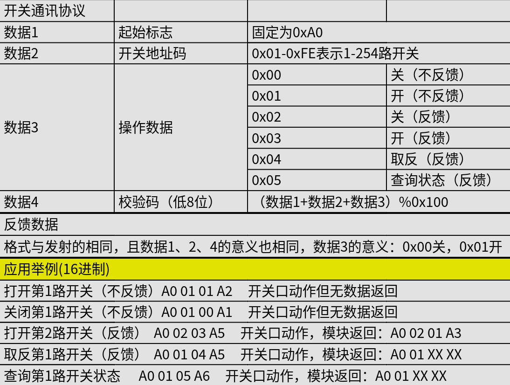

# USB2Serial Switch

本项目提供的 `switch.py` 封装了USB串口继电器的常见使用场景，建议全局安装以便于使用。

购买链接（仅供参考）
- [1路免驱电脑控制开关 LCUS-1 USB智能控制开关模块串口控制继电器](https://detail.tmall.com/item.htm?abbucket=17&detail_redpacket_pop=true&id=624900251710&ltk2=1751548589700a2wzcb3yl8anv7gjd9lizi&ns=1&priceTId=214781a917515484804032192e1a79)
    - 提供 1、2、4 路控制，总计三款

## Driver (USB serial)

市面上的USB串口芯片，基本上出自 [wch](https://wch.cn/)。该公司开源了常见的 ch34x 系列芯片的驱动：
- [ch341ser_linux](https://github.com/WCHSoftGroup/ch341ser_linux)
- [ch343ser_linux](https://github.com/WCHSoftGroup/ch343ser_linux)

> 内核中可能已包含相关驱动，但不保证支持芯片所有特性。

## Protocol

市面上的成品大都遵循了以下协议：

## Dependency

首先自然要存在相关驱动，其次，本项目项目依赖 `pyserial` 库。

> 可使用 `pip` 或发行版包管理器安装。
